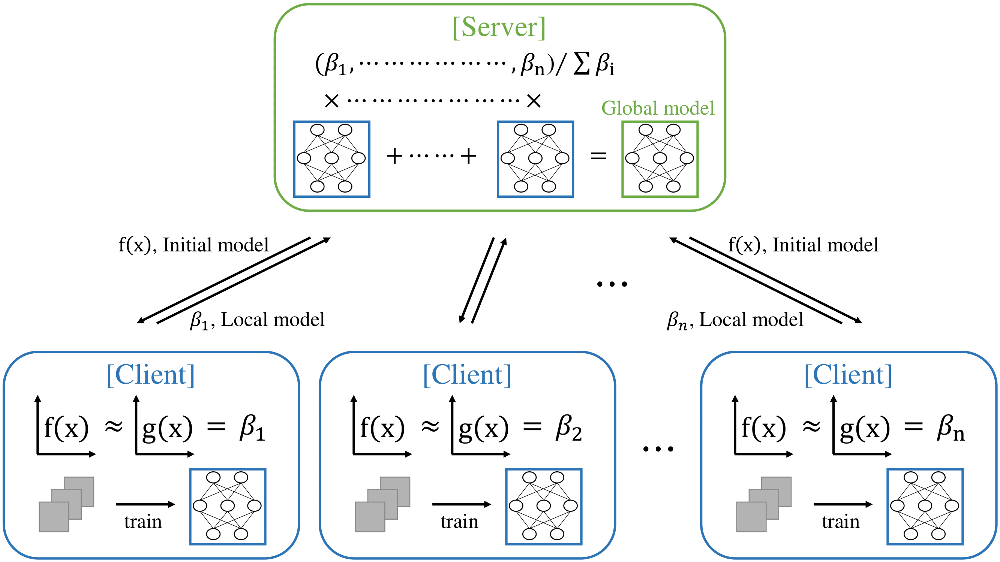

<p align="center">
  <a href="https://www.sciencedirect.com/journal/applied-soft-computing">
    
  </a>
  <a href="https://github.com/AndrewKim1997/federated-regressive-learning/actions/workflows/ci.yml">
    
  </a>
  <a href="https://github.com/AndrewKim1997/federated-regressive-learning/actions/workflows/docker.yml">
    
  </a>
  <a href="docs/DOCKER.md">
    
  </a>
  
  <a href="LICENSE">
    
  </a>
</p>

<h1 align="center">Federated Regressive Learning (FRL)</h1>

> A drop-in **server-side aggregator** that weights client updates by **data size** and **distribution alignment**.<br>
> FRL measures each client’s label distribution against a chosen **reference** (default: uniform) via a statistical distance (e.g., **Wasserstein**, **JS**), converts distance to an affinity, multiplies by sample counts, and **normalizes** to obtain weights β<sub>i</sub> for global averaging.

- **Paper**: <em>Federated regressive learning: Adaptive weight updates through statistical information of clients</em> — Applied Soft Computing (2024) [https://www.sciencedirect.com/journal/applied-soft-computing](https://doi.org/10.1016/j.asoc.2024.112043)
- **Core idea**: compute per-client distances to a reference distribution → turn distances into affinities → multiply by size priors → **normalize** to obtain β and aggregate. Works as a **FedAvg-compatible** replacement (IID ≈ FedAvg).

---

## ✨ TL;DR

- **Handles non-IID**: clients closer to the reference get **larger β**, far clients are **softly down-weighted**; size skew handled via a **sample-count prior**.  
- **Reduces to baseline**: under near-IID, β approaches size-weighted averaging (i.e., FedAvg-like behavior).  
- **Interpretable**: we log **β**, pairwise **distances**, and per-client **class histograms** for auditability.  
- **Minimal friction**: no custom loss; plug the aggregator into your training loop.

---

## 📊 Results at a glance

<p align="center">
  <a href="docs/media/frl-algorithm.pdf">
    
  </a><br>
  <sub>Click to open the PDF</sub>
</p>

---

## 📚 Table of Contents

* [Install](#-install)
* [Quick start](#-quick-start)
* [Scenarios](#-scenarios)
* [Reproducibility](#-reproducibility)
* [Datasets & Privacy](#%EF%B8%8F-datasets--privacy)
* [Docker](#-docker)
* [Repository layout](#-repository-layout)
* [Cite](#-cite)
* [Contributing](#-contributing)
* [License](#-license)

---

## 🚀 Install

### Option A — Conda

```bash
conda env create -f env/environment.yml
conda activate frl
pip install -e .[dev]
```

### Option B — venv + pip

```bash
python -m venv .venv && source .venv/bin/activate
pip install -U pip
pip install -e .[dev]
```

> **Torch note:** FRL’s core runner uses NumPy; `torchvision` is required only for CIFAR-10.

---

## ⚡ Quick start

### 1) Generate a split (S1)

```bash
python -m frl.scenarios.scenario_gen \
  -c frl/scenarios/s1_equal_dist_diff_size.yaml \
  -o results/scenarios --preview
```

### 2) Run FRL vs baselines (MNIST · CPU)

```bash
python scripts/run_federated.py \
  --dataset mnist \
  --scenario frl/scenarios/s1_equal_dist_diff_size.yaml \
  --aggregator frl \
  --rounds 3 --local-epochs 1 --batch-size 256 --lr 0.1

python scripts/make_fig_tables.py \
  --glob "results/logs/*.csv" --outdir results/figures
```

### 3) CIFAR-10 smoke (requires `torchvision`)

```bash
python -m frl.scenarios.scenario_gen \
  -c frl/scenarios/s2_hetero_dist_diff_size.yaml \
  -o results/scenarios --preview

python scripts/run_federated.py \
  --dataset cifar10 \
  --scenario frl/scenarios/s2_hetero_dist_diff_size.yaml \
  --aggregator frl \
  --rounds 1 --local-epochs 1 --batch-size 256 --lr 0.1 \
  --log-dir results/logs
```

---

## 🧪 Scenarios

* **S1 — equal distribution, different client sizes**
* **S2 — heterogeneous distributions & sizes**

  * Two modes: **Dirichlet** (`alpha`) or **fixed per-client class proportions** (`class_props`).
  * Tip: if you specify `clients.sizes`, make sure the sum equals the dataset size (or leave as `null` to auto-even).
* **S3 — class-missing + heterogeneity**

Edit the YAMLs under `frl/scenarios/` and regenerate; see **`docs/SCENARIOS.md`** for definitions and examples.

---

## 🔁 Reproducibility

* Seeds are set via `frl.utils.set_seed(seed)` and per-scenario YAML `seed`.
* CI (GitHub Actions) runs unit tests and **MNIST/CIFAR smoke**.
* Export provenance with:

```bash
python -m pip freeze > results/requirements-$(date -u +%Y%m%dT%H%M%SZ).txt
python --version   > results/python-version.txt
git rev-parse HEAD > results/git-commit.txt
```

See **`docs/REPRODUCIBILITY.md`** for details.

---

## 🗂️ Datasets & Privacy

* **MNIST**: loaded via scikit-learn (OpenML) to NumPy arrays `[0,1]`.
* **CIFAR-10**: via `torchvision`; converted to NumPy for training.
* **UGEI**: **not distributed** (privacy & contractual restrictions). A placeholder interface is provided; see **`docs/PRIVACY.md`**.

> Never commit raw data. This repo ignores `data/` and large artifacts by default.

---

## 🐳 Docker

Two first-class images are provided:

* **CPU** — no PyTorch/torchvision
  `docker build -f docker/Dockerfile.cpu -t frl:cpu .`
* **CUDA** — includes PyTorch/torchvision (CUDA 12.1 wheels)
  `docker build -f docker/Dockerfile.cuda -t frl:cuda .`

Run (CPU):

```bash
docker run --rm -it -v "$PWD:/app" frl:cpu \
  bash -lc 'python -m frl.scenarios.scenario_gen -c frl/scenarios/s1_equal_dist_diff_size.yaml -o results/scenarios --preview && \
            python scripts/run_federated.py --dataset mnist --scenario frl/scenarios/s1_equal_dist_diff_size.yaml --aggregator frl --rounds 3 --local-epochs 1 --batch-size 256 --lr 0.1'
```

Run (CUDA, GPU host):

```bash
docker run --gpus all --rm -it -v "$PWD:/app" frl:cuda \
  bash -lc 'python -m frl.scenarios.scenario_gen -c frl/scenarios/s2_hetero_dist_diff_size.yaml -o results/scenarios --preview && \
            python scripts/run_federated.py --dataset cifar10 --scenario frl/scenarios/s2_hetero_dist_diff_size.yaml --aggregator frl --rounds 1 --local-epochs 1 --batch-size 256 --lr 0.1'
```

See **`docs/DOCKER.md`** for more.

---

## 🧭 Repository layout

```
federated-regressive-learning/
├── frl/                  # library: algorithm, aggregation, metrics, data, scenarios
├── scripts/              # run_federated.py, make_fig_tables.py
├── frl/scenarios/        # S1/S2/S3 YAMLs + generator
├── configs/              # training/optimizer/dataset configs
├── examples/             # minimal, runnable examples
├── docs/                 # REPRODUCIBILITY, SCENARIOS, PRIVACY, DOCKER
├── tests/                # unit & smoke tests
├── env/                  # environment.yml, requirements.txt
└── docker/               # Dockerfile.cpu, Dockerfile.cuda
```

---

## 📝 Cite

If you use this repository, please cite the paper (or see `CITATION.cff`):

```bibtex
@article{kim2024federated,
  title={Federated regressive learning: Adaptive weight updates through statistical information of clients},
  author={Kim, Dong Seok and Ahmad, Shabir and Whangbo, Taeg Keun},
  journal={Applied Soft Computing},
  volume={166},
  pages={112043},
  year={2024},
  publisher={Elsevier}
}
```

---

## 🤝 Contributing

Contributions are welcome!
Please ensure:

* `pytest` passes and **ruff** shows no errors,
* new scenarios/configs include seeds,
* results/logs are excluded from commits.

---

## 📄 License

Code is released under the **MIT License** (see `LICENSE`).
Datasets remain subject to their original licenses; **UGEI is not distributed**.
